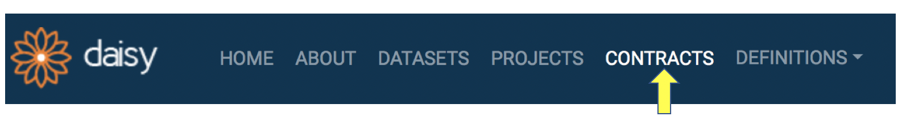
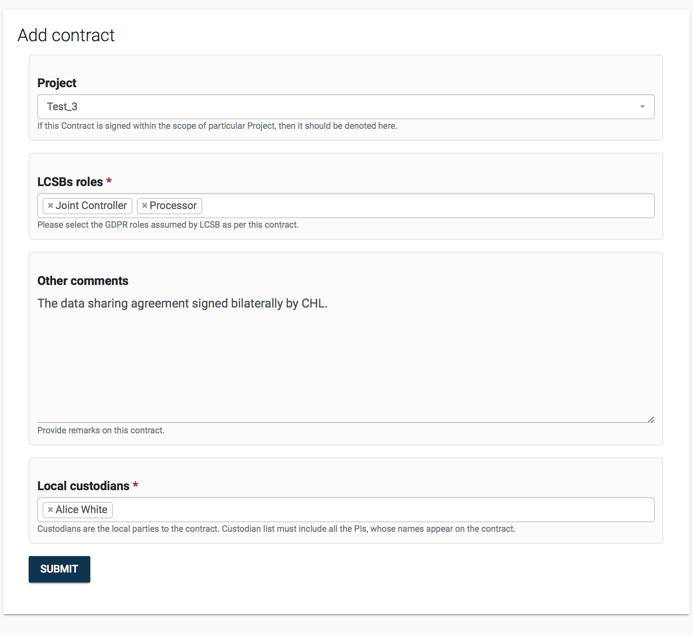
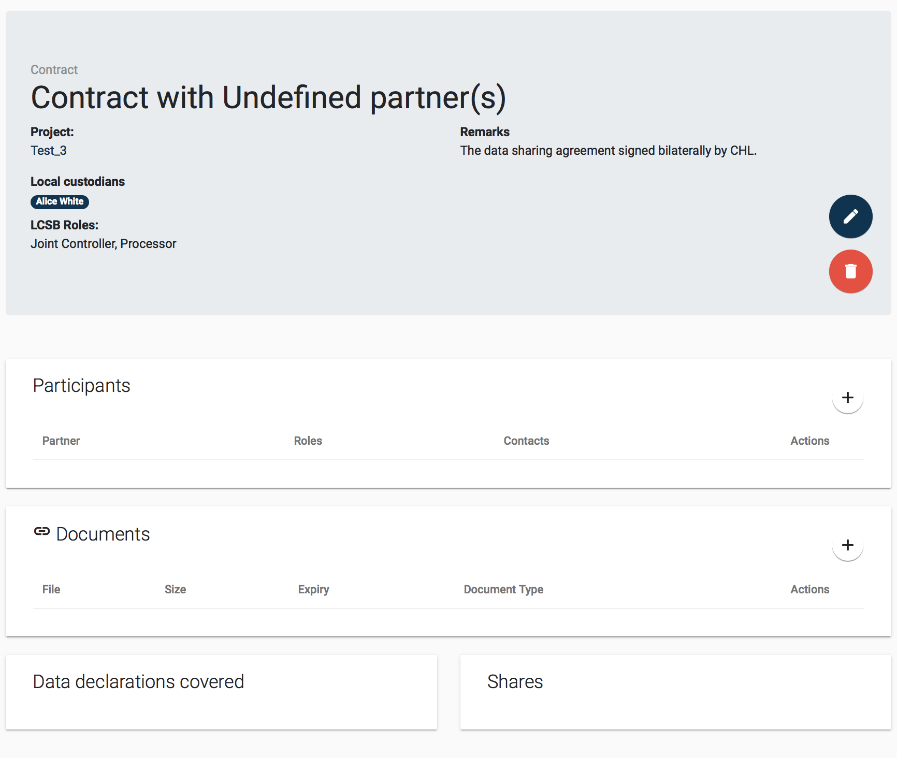
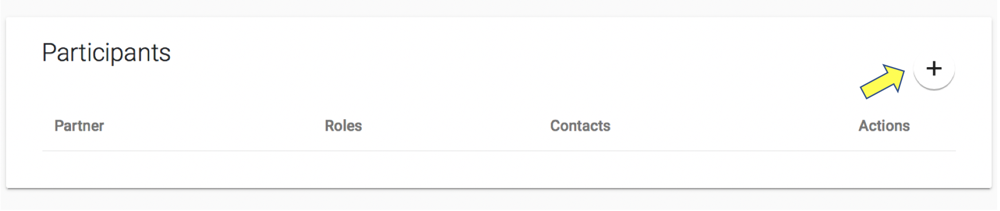
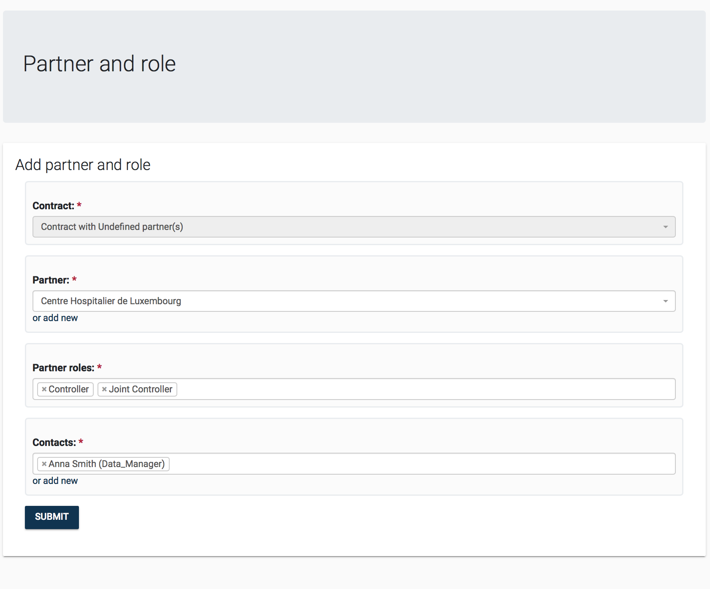
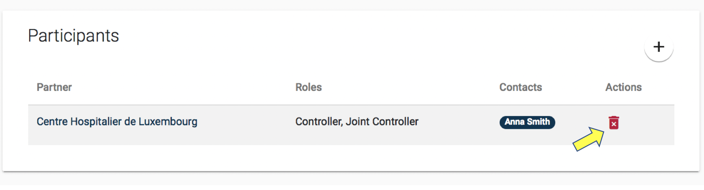

<small>
[User guide](/manual/daisy) &raquo; [*Contracts (**GO BACK to main page**)*](/manual/daisy/#contracts)
</small>

# 5 Contract Management

The *Contract Management* module allows recording legal documents signed in the context of research activities. Contracts are typically linked to *Projects* and provide the necessary traceability for the GDPR compliant provision and transfer of data.

## 5.1 Create New Contract

<mark>In order to create a new contract:</mark>

1. Click Contracts from the Menu Bar.

::: centered

:::

2. Click the add button from the Contract Search Page.

::: centered

:::

3. You will see an empty Contract Form. The *Project* field is optional, meanwhile, in practice most contracts are signed in the context of a research project. In the *Roles* field, you are expected to select one or more GDPR role that identifies your institutions roles as described in the Contract. The roles are: *Controller*, *Joint Controller* and *Processor* ([find out more about the GDPR roles](https://edps.europa.eu/sites/edp/files/publication/19-11-07_edps_guidelines_on_controller_processor_and_jc_reg_2018_1725_en.pdf)).
In the *Other comments* section you may describe the nature of the document or if the document has an ID/REF e.g. from a document management system, you may put it in. Just like projects and datasets, when creating contracts you are expected to provide a local responsible in the *Local Custodians* field. As stated before, one of the Local Custodians must be a user with VIP Privileges.

::: centered

:::

1. Click SUBMIT. Once you successfully save the form, you will be taken to the newly created
   contract's details page, as seen below.

::: centered

:::

## 5.2 Manage Contract Details

After initial creation the contract will be in a skeletal form and would need further input on its signatories and document attachments. As per above image, you can add following contract details:

- Participants
Contracts have multiple signatories. These can be  managed via the *Partners (Signatories)* detail box.

  1. Click the plus button  on the *Partners (Signatories)* details box, as seen below.

::: centered

:::
  2. You will see the *Partner and role* addition form. In this form, you will be asked to select the _Partner_ as well as the  GDPR _Roles_ that this partner assumes in the contract. You can select more than one role. It is also mandatory to provide a contact person that is with the selected partner institute. You can either select from the list or you can add a new contact if it does not already exist.

::: centered

:::
  3. Once you fill in the information and click SUBMIT the partner will be added to the list of signatories, as seen below. Partners can be removed from a contract by clicking on the trash icon that will appear when hovering over the items in the *Partner and role detail box*.
  

- Documents
You may attach PDF, word documents, scans, via the *Documents* detail box. Document management is common throughout DAISY modules. More details in section [Manage Project Documentation](/manual/project_management_details/#325-manage-project-documentation)).

