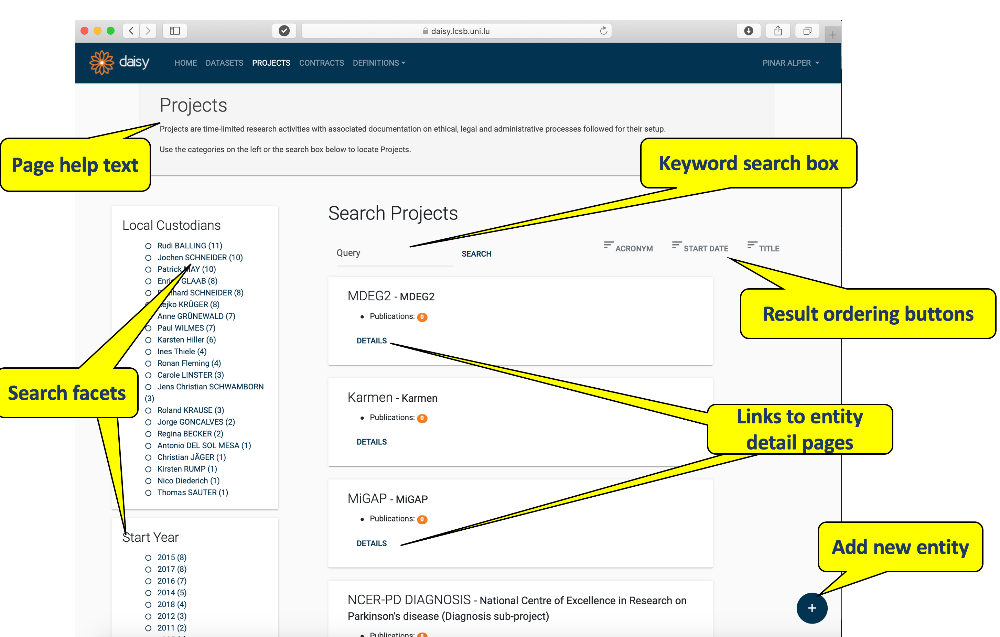
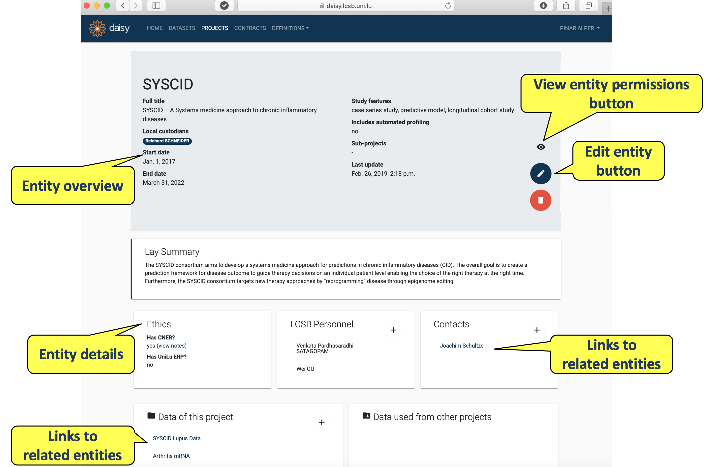
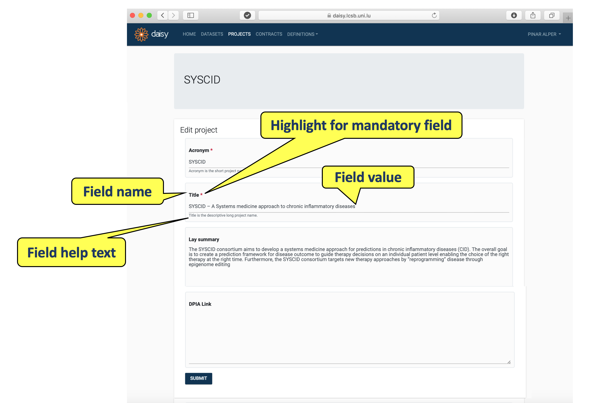
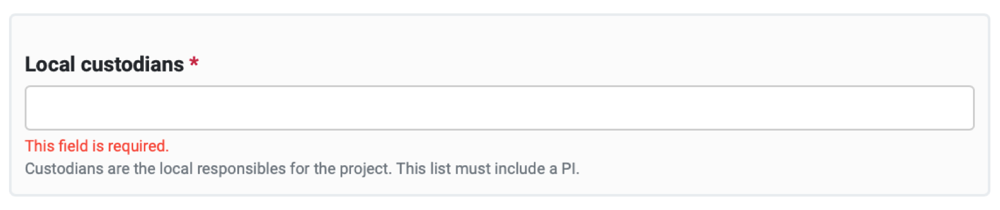
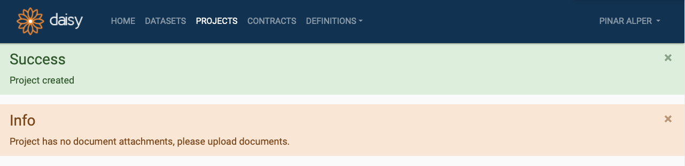
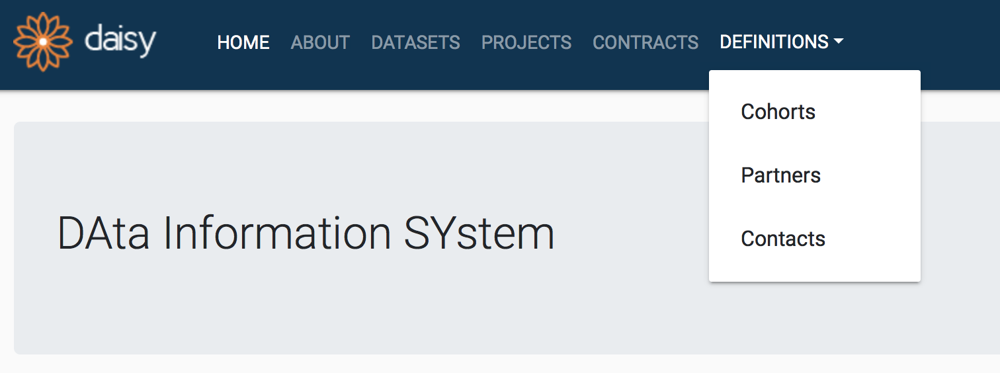

# Daisy User Guide

Welcome to the user guide for the DAta Information SYstem (DAISY). DAISY is a tool that assists GDPR compliance by keeping a register of personal data used in research.

# 1. Quickstart
## 1.1 Login and User Homepage

Upon successful installation of DAISY, go to the web address
`https://${IP_ADDRESS_OR_NAME_OF_DEPLOYMENT_SERVER}`, where you should display the login page.

<!-- If you are University of Luxembourg staff you can go to [https://daisy.lcsb.uni.lu/](https://daisy.lcsb.uni.lu/).
You can also check [DAISY demo deployment](https://daisy-demo.elixir-luxembourg.org/). -->

Based on the authentication configuration made for your deployment, you may log in by:

* the user definitions in an existing LDAP directory, e.g. institutional/uni credentials.
* the user definitions maintained within the DAISY database.

<small>DAISY Login Page</small>

After successful login, you see DAISY home page.

<small>DAISY User Home Page</small>

[Back to top](#daisy-user-guide)

## 1.2 DAISY Interface Conventions
The main view of each DAISY module is called [Search Page](#search-pages), where you choose entity you are interested in (or create a new module). You can inspect a particular entity details in [Entity Details Pages](#entity-details-pages) and edit them in [Entity Editor Pages](#entity-editor-pages).

### Search Pages
DAISY provides search pages for all entities manageable via modules. Currently these modules are: *Datasets*, *Projects*, *Contracts* and under *Definitions*: *Cohorts*, *Partners*, *Contacts*. All search pages have similar layout and operational conventions. Search pages are also the only entry point for the functions in a module. When you select a module from the menu bar, you will be taken to the search page for the entity managed by that module.

As an example, the screenshot of the search page for Projects is given below.
Each search page is headed with the help text containing a brief description. On the left hand side of the page there are search facets and on the right - the search results are displayed.

<small>Search page for Projects</small>

By default, all entities (in our example - projects) will be listed on the search page. The list can be filtered by either selecting one or more facet from the left hand side or by typing in a keyword into the search box. Note that currently **DAISY search does not support partial matching**. Instead, the entire keyword will be matched in a case insensitive manner.

On the top right section of search results a few attributes are listed. Clicking on these attributes repeatedly will respectively (1) enable the ordering; (2) change order to ascending/descending; (3) disable ordering for the clicked attribute.

Each entity listed in the search results is displayed in a shaded box, containing few of its attributes. In our example these are the project's name and the number of publications. Each result box will also contain a *DETAILS* link, through which you can go to the [Entity Details Page](#entity-details-pages).

Depending on the permissions associated with your user type, you may see a **add button (denoted with a plus sign)** at the bottom right section of the search page. You can add a new entity by clicking the plus button, which will open up an empty editor form for you to fill in.

### Entity Details Pages
Clicking the *DETAILS* button in the search result box takes you to *Details Page*, which contains the information about the chosen entity. An example of details page for *Project* named 'SYSCID' is given below.

<small>Details page of a Project in DAISY</small>

You may end up on an *Entity Details Page* through:

* the *DETAILS* link of a search results in a search page.
* the links on details pages of other (linked) entities in DAISY.

Each Details Page is headed with an **entity overview box** listing some of the entity's attributes (e.g. local custodians, start date) and allows to modify the entity. Depending on users permissions (see [users groups](#3-different-types-of-daisy-users)) in the right bottom corner of the overview box you may see:

* permissions button (denoted with an eye icon),
* edit entity button (denoted with a pencil icon),
* remove entity button (denoted with a bin icon).

Beneath the entity overview box there are several information boxes, which display the further details of the entity (e.g. personnel, ethics).

If you have edit permissions for the entity, then at the top right corner of particular detail boxes you will see an **add detail button (denoted with a plus sign)**. Via this button you can do the following:

* create links to other entities e.g.  link contacts with projects.
* create (inline) detail records to the current entity e.g. one or more publications to a project.

### Entity Editor Pages
When you click the edit button on the Details Page of an entity, you will be taken to the Editor Page containing a form for entity update.  An example of **editor form** is given below.

<small>Editor page of a Project</small>

Each field in the form is be listed with a **name**, a **value** and a **help text**. Names of the fields that are required to have a value, are marked with a red asterisk (e.g. Title).

Editor forms can be saved by pressing **SUBMIT** button at the bottom of the page. The forms will be validated upon the submission. If the validation fails for one or more fields, these will be highlighted with inline validation error message, illustrated below.

<small>Field validation error message</small>

Upon successful submission of a form, you will be returned to the Entity Details page.
DAISY may give success and/or warning messages upon the form submission; these will be displayed at the top of the page, as illustrated below.

<small>Status message displayed in DAISY</small>

[Back to top](#daisy-user-guide)

# 2. What records can be kept with DAISY?

This section contains a brief description of DAISY functions listed in the application's menu bar (image below) and some tips how to effectively familiarise with DAISY application.

<small>DAISY Menu bar</small>

## 2.1 Projects
Projects Management module allows for the recording of research activities as projects. Documenting projects is critical for GDPR compliance as projects constitute the purpose and the context of use of the personal data.
Any document supporting the legal and ethical basis for data use can be stored in DAISY (e.g. ethics approvals, consent configurations or subject information sheets). [**Go to Project Management**](project_management_details.md)

## 2.2 Datasets

Datasets Management module allows for the recording of personal data held by the institution. The dataset may or may not fall in the context of a particular project. DAISY allows datasets to be defined in a granular way; where - if desired - each data subset, called a *data declaration*, can be listed individually. These declarations may list data from a particular partner, data of a particular cohort or data of a particular type.
[**Go to Dataset Management**](dataset_management_details.md)

## 2.3 Contracts

Contracts Management module allows for the recording and storage of legal contracts of various types that have been signed with partner institutes or suppliers. Consortium agreements, data sharing agreements, material transfer agreements are the examples of the contracts.

 For GDPR compliance the contracts become useful in case of documenting the received datasets source or transferred datasets target. [**Go to Contracts Management**](contract_management_details.md)

## 2.4 Definitions
Definitions Management module allows the maintenance of secondary entities, which are used when defining the contracts, projects or datasets. Users can manage cohorts, partner institutes and contact persons via the definitions module.
[**Go to Definitions Management**](definitions_management_details.md)

[Back to top](#daisy-user-guide)

# 3. Different types of DAISY users

Any user with an account can login to DAISY and start creating records.  Users that create a record become the record's *owner* and will be able to change and delete the record at any time.
In DAISY, a records owner, however, is not the one with the utmost privileges. DAISY provides various types of users accounts, and associated privileges.

<!-- This is the default role assigned to all users. All DAISY users can view all Dataset, Project, Contract and Definitions. The document attachments of records are excluded from this view permission. -->

- **Standard user**
The default type of user is a standard user. Standard users can:

	- view any *Dataset*, *Project*, *Contract* or *Definition* record in DAISY, including those created by others. The documents attachments on the records are, however, protected, and they are not visible to other standard users.
	- create records of their own.
	- edit and delete records of their own.

- **VIP user**
The research principle investigators are VIP type users. Whenever a *Dataset*, *Project*, *Contract*  record gets created in DAISY, a VIP user **must be designated** as the record's **Local Custodian**. Records cannot be created without a local custodian.
In addition to the privileges of the standard user, the VIP Users have the following rights:

	- view, edit and delete records under his custodianship,
	- view and manage the document attachments of records under their custodianship,
	- grant other users permissions on the records under his custodianship.

- **Legal user**
The users assigned to this group can are allowed to manage *Contract* records. Legal personnel can:

	- add, view, edit and remove any contract.
	- grant the other users with an access for the contract.
	- view all records in DAISY and manage their documents attachments.

For more details go to [Users Groups and Permissions](user_management_details.md) (recommended for those administering DAISY deployments).

[Back to top](#daisy-user-guide)
