<small>
[User guide](daisy.md) &raquo; [*Datasets (**GO BACK to main page**)*](daisy.md#22-datasets)
</small>

# 4 Dataset Management

## 4.1 Create New Dataset

<mark>In order to create a new Dataset:</mark>

1. Click Datasets from the Menu Bar.

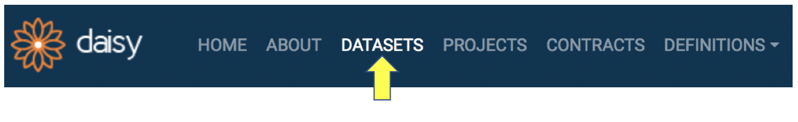

2. Click the add button (in the right bottom corner) from the *Dataset Search Page*.

3. You will see the *Dataset Creation Quick Form*. Fill the fields and click SUBMIT.

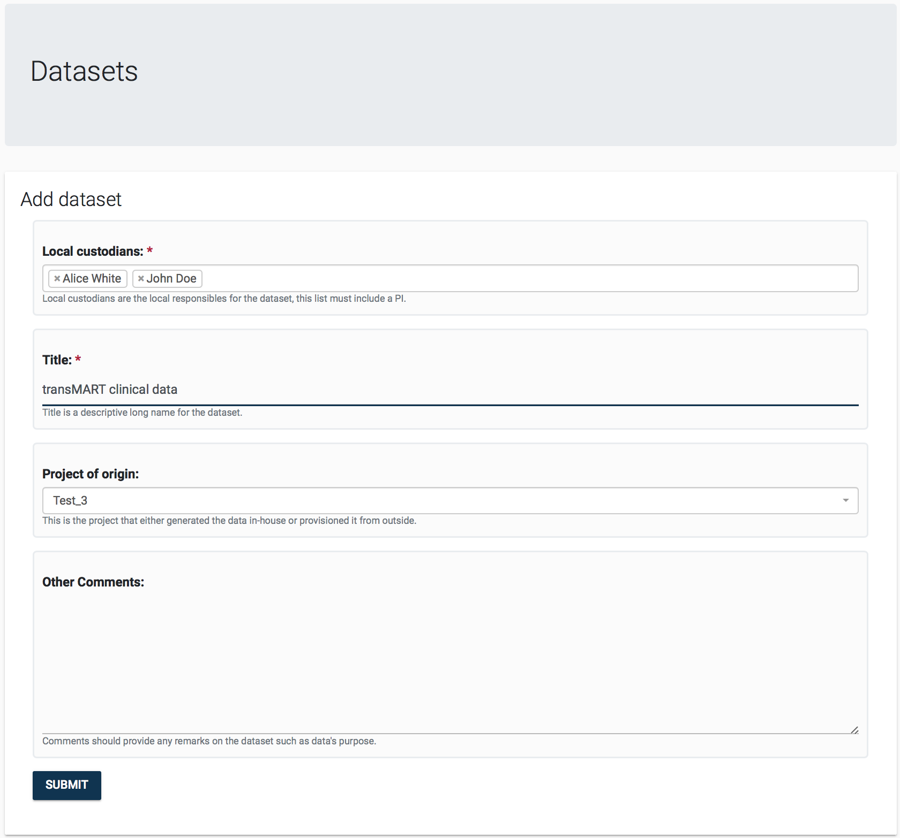

4. Once you successfully save the form, you will be taken to the newly created dataset's details page, as seen below.

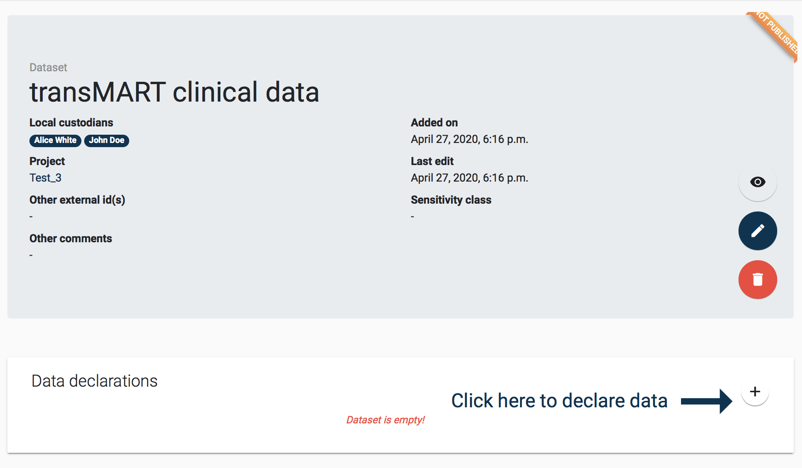

## 4.2 Manage Dataset Details

Dataset entity details box are displayed in dataset page, where you can add, edit or remove following details:

- Data declarations
- Legal bases
- Storages
- Accesses
- Transfers

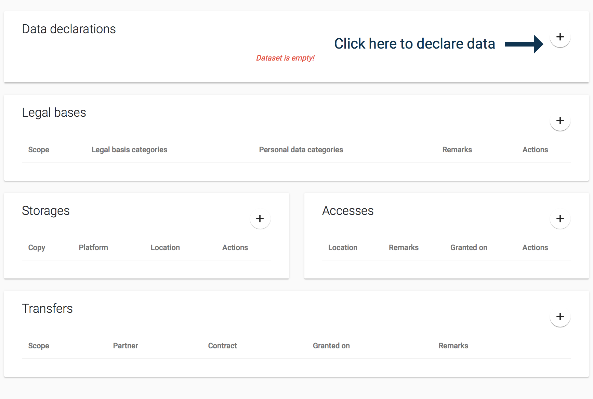<small>Dataset's entities detail boxes</small>

After initial creation the dataset will be in a skeletal form. The dataset needs to be fleshed out with further information on the characteristics of the data it contains.

## 4.2.1 Declare Data within the Dataset

<mark> To add new data declaration: </mark>

1. Click the plus button  on the *Data declarations* details box.

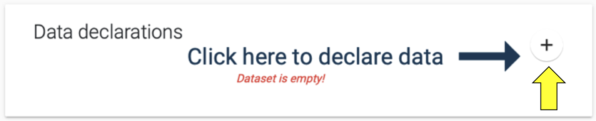

2. You will see the *Data declaration Creation Quick Form* as below. With the *Data declaration Creation Quick Form* you are asked for a *Title*  for the declaration and denote where the data was *Obtained from* by selecting one of three options. For the *Title* one can use the same title you used earlier when creating the dataset. However, if you're going to have multiple declarations within a dataset you can give them names based on their source or their type (e.g. Helsinki Cohort, Parkinson Study-2, LuxPARK PARK2 Cell lines etc). It is important that the *Title* is a name that is familiar to you and your research group as it will be used in free text search over datasets. The options for the *Obtained from* field is described in detail below.

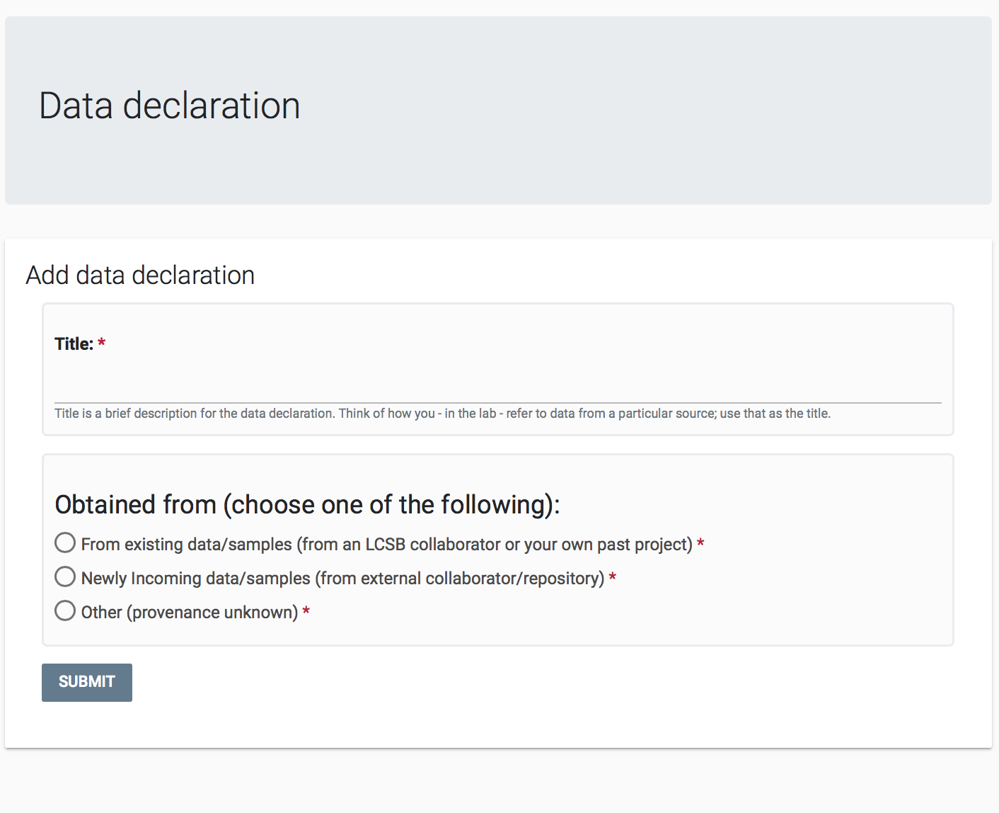

3. Click SUBMIT. The data declaration will be created and you will be taken to the *Data Declaration Editor Page*.

<big> **Obtained from** field</big>
This field captures important information, but, for the first-time users of DAISY it can be difficult to populate. Your choice among the three options will determine if and how your dataset will be linked to other entities in DAISY. If you are a first-time user and you are creating records for learning purposes, we suggest that you choose the option *Other* for simplicity.

- **From existing data/samples**
  When you state that the data is obtained from existing data/samples in your institution, DAISY will prompt you (as below) to search for and choose the data record which is the origin for your current declaration.

  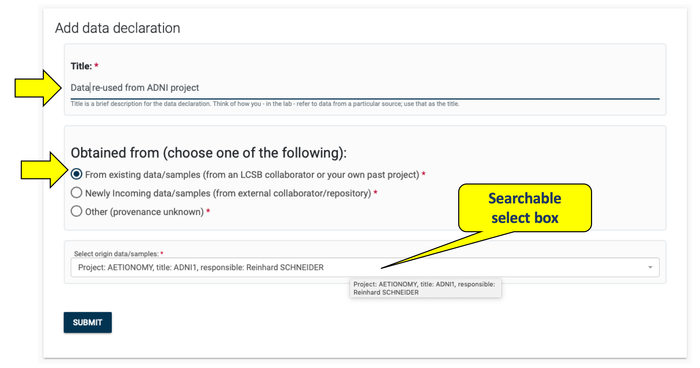

  You will be provided a searchable selection box, through which you can find existing data records by their Project, by responsible PI or by their title. As you will be making a selection from existing records, with this option, it is necessary that origin data had been entered into DAISY earlier.

  By choosing the **from existing data/samples:**  you will link the newly created data declaration to an existing data declaration in daisy, as depicted below.

  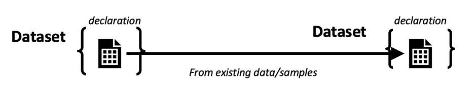

- **Newly incoming data/samples**
  When you select this option, it means you are obtaining data from a collaborator institute or from a repository and this data is being recorded for the first time in DAISY. With this option DAISY will first ask you to select a partner (institutes and repositories are both  in the partner list). Once you select a partner DAISY will then list all those contracts that are in the system involving this partner and that have local custodians overlapping with the custodians of the dataset you're detailing. If there are no such contracts or if none of the existing contracts foresee the receipt of this data, then you have to option to create an empty contract. You can later on provide the details and documentation for this empty contract. In that case the empty contract acts as a link to the source partner for the data.

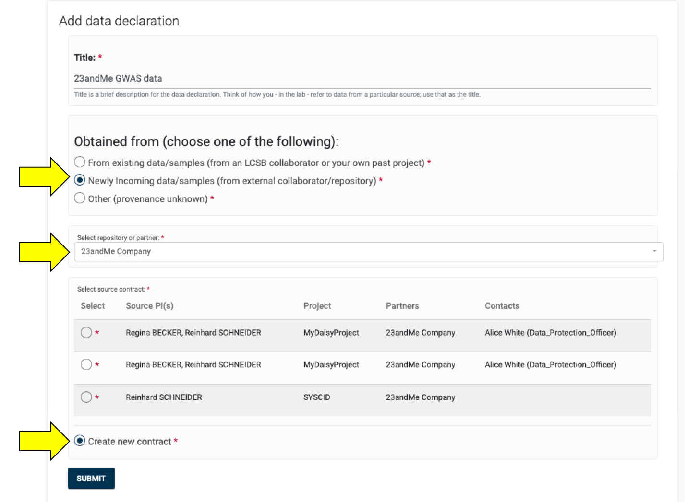

  When the  **newly incoming data/samples**  option is chose, DAISY will link the newly created data declaration to a Contract and and associated Partner(s), as depicted below.

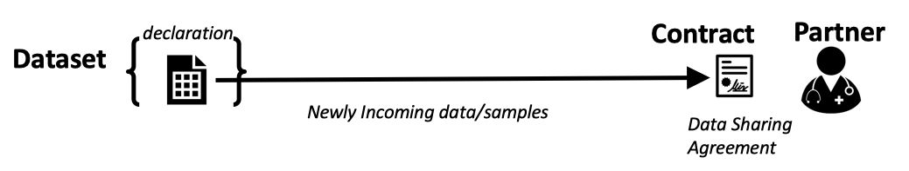

- **Other**
  When you select this option, it means you do not want to create  any structured DAISY records to denote the origin of data being declared. DAISY will prompt you to provide a free-text description of the origin of data as seen below.

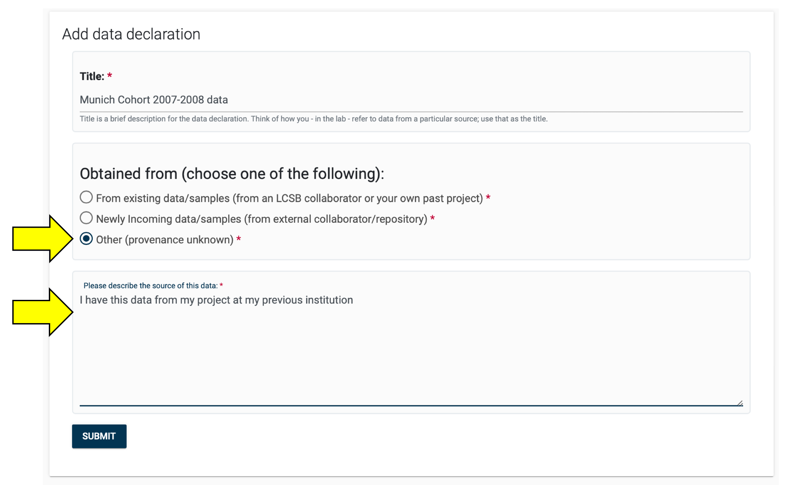

  Data declared with the **Other** option will not have links to any other records as to its origin.

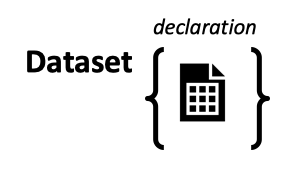

After selecting any one of the options and creating the data declaration, you will be taken back to the *Dataset Details Page*. You can see the newly added declaration listed in the *Data Declarations* detail box. This box also provides action buttons  for  editing, deleting, and cloning  data declarations, as seen below.

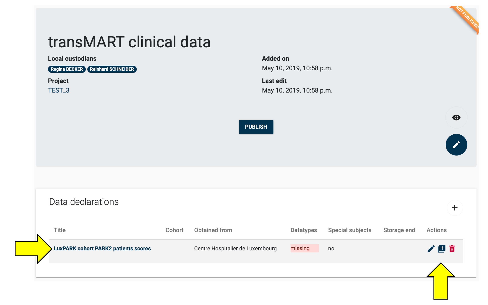

Once created you are advised to edit the declaration to provide further information about the data. Data declarations have a rich set of fields in addition to the title and origin supplied during their creation.

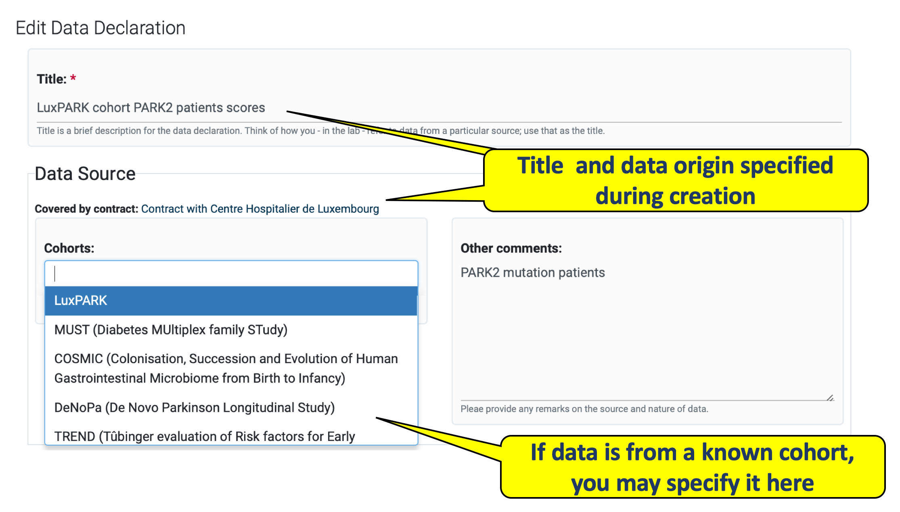

[Back to top](#4-dataset-management)

## 4.2.2 Manage Dataset Legal basis
GDPR outlines six legal basis under which data processing is legally permitted ([find out more about the Legal basis](https://gdpr-info.eu/art-6-gdpr/)).

<mark> To add new data legal bases: </mark>

1. Click the plus button on the Legal bases details box.

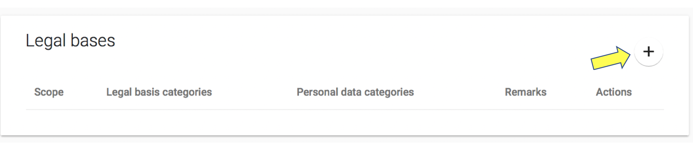

2. The *Legal base create form* will be displayed. Fill in the fields. The *Legal Bases* is mandatory and multiple choices field.

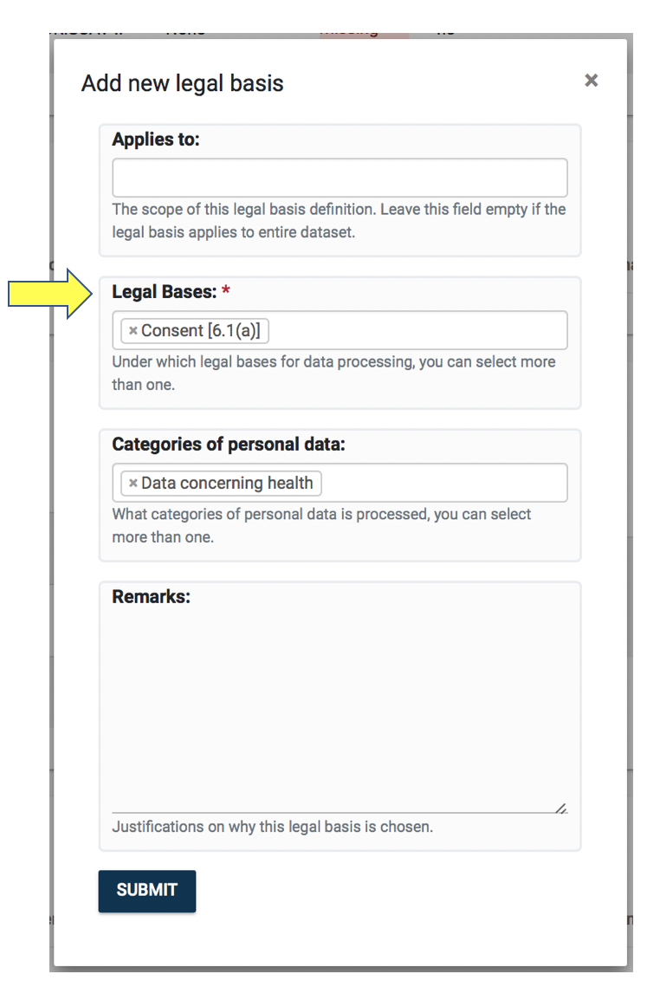

3. Click SUBMIT. In the *Dataset Search Page* you will see legal bases you have just added. It can be edited or deleted by clicking on the pencil/trash icons.

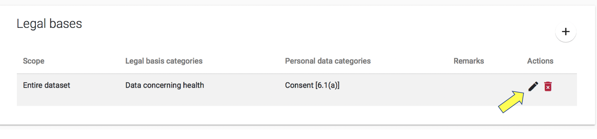

[Back to top](#4-dataset-management)

## 4.2.3 Manage Dataset Storages

As per GDPR, the storage of personal data is considered as a `data processing` and needs tone recorded. The *Storages detail box* allows you to do this. In order to record a new storage location:
1. Click the plus button  on the *Storages* detail box depicted below.

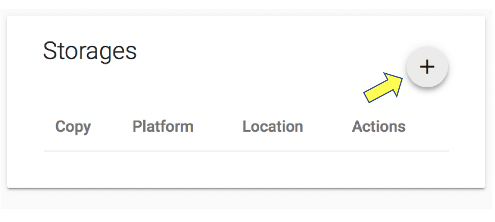

2. You will see the location creation form asking you for the *Storage back-end* and the  *Nature of data copy* the *Stored datatypes* (optional) and *Location of the data* for the paper. The backend box will list storage platforms for your institution, you need to select one and in the location box you are expected to provide information on where the data can be found on the selected platform. Note that you are not expected to document the individual files. E.g. it is good practice to record the top level folder in which a certain dataset exists. The datatypes are optional and if you are not separately storing data subsets by type then there is no need to specify datatype information for a location.

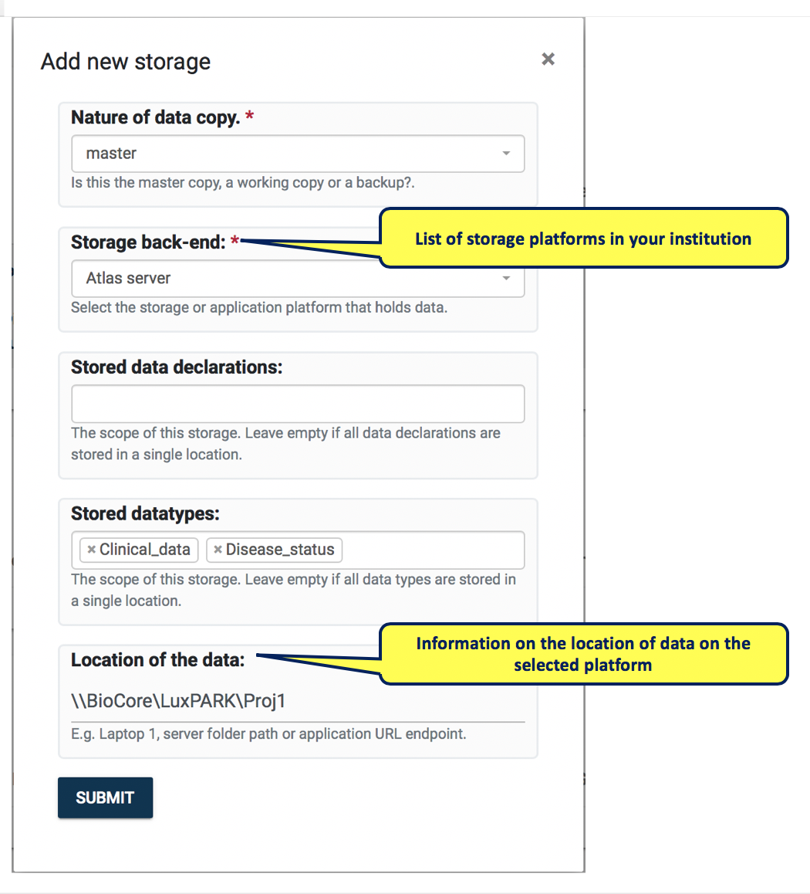

3. Click SUBMIT and the new location will be listed as below. Storage locations can be edited or deleted by clicking on the pencil/trash icon in the *Storages detail box*.

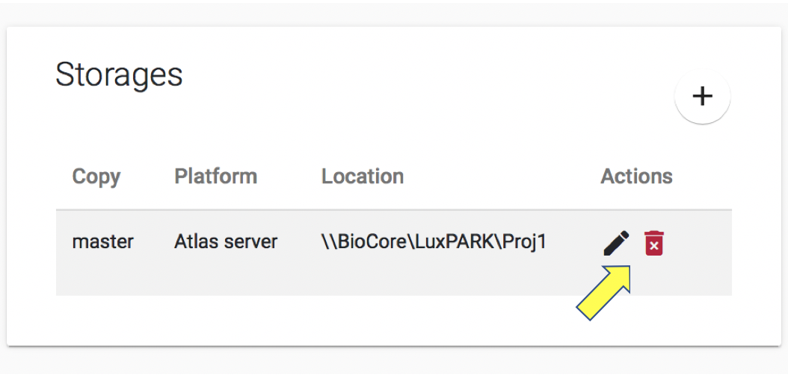

[Back to top](#4-dataset-management)

## 4.2.4 Manage Dataset Accesses

As per GDPR, any access to personal data held in an institution needs to be recorded. The *Accesses detail box* allows you to do this.
**IMPORTANT NOTE: Before recording access, make sure you have recorded storage locations of data.**

<mark>In order to add a new access record:</mark>

1. Click the plus button  on the *Accesses* detail box depicted below.

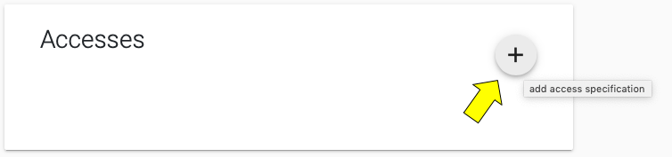

2. You will see the access creation form. Access is defined over a specific storage location, so you'd need to select one  from the _Data Locations_ list. In addition you'd need to document the access control policy in the _Remarks_ section.  If access is time-limited you may specify the start and end dates for its validity. By default all accesses recorded will fall under the scope of the project, which owns the  dataset. It is also possible to record accesses, in the scope of other projects, to do so you must select one from the _Project_ list. We discuss access across projects later in this section.

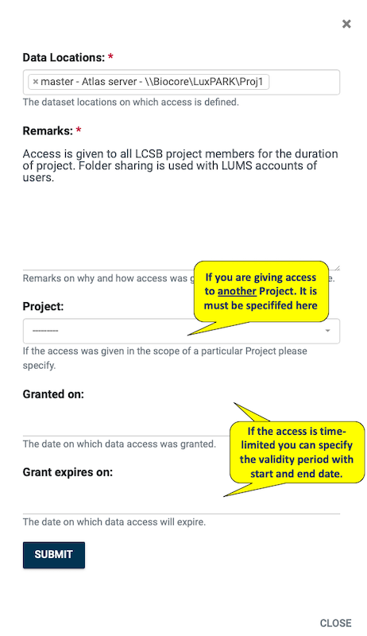

3. Click SUBMIT and the new access will be recorded and listed on the dataset's page as below. Accesses can be edited or deleted by clicking on the pencil/trash icons in the *Accesses detail box*.

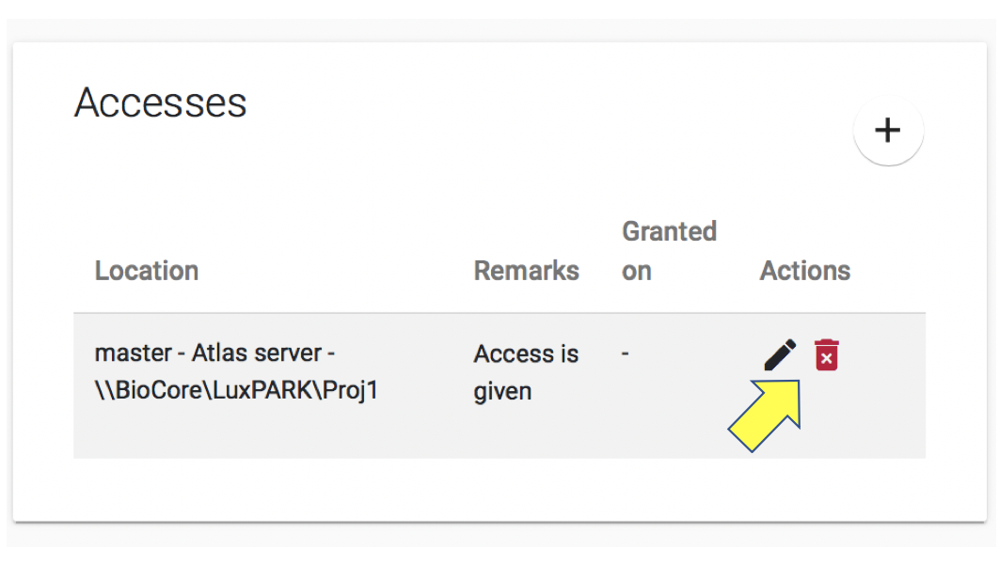

As discussed above, when data of one project is being accessed in the context of another project, this can be specified in the access creation form by selecting a Project (see below left). When you create access records in this way, the dataset will be linked to the project accessing it. This dataset will be listed in the **Data used from other projects** detail box (see below right).

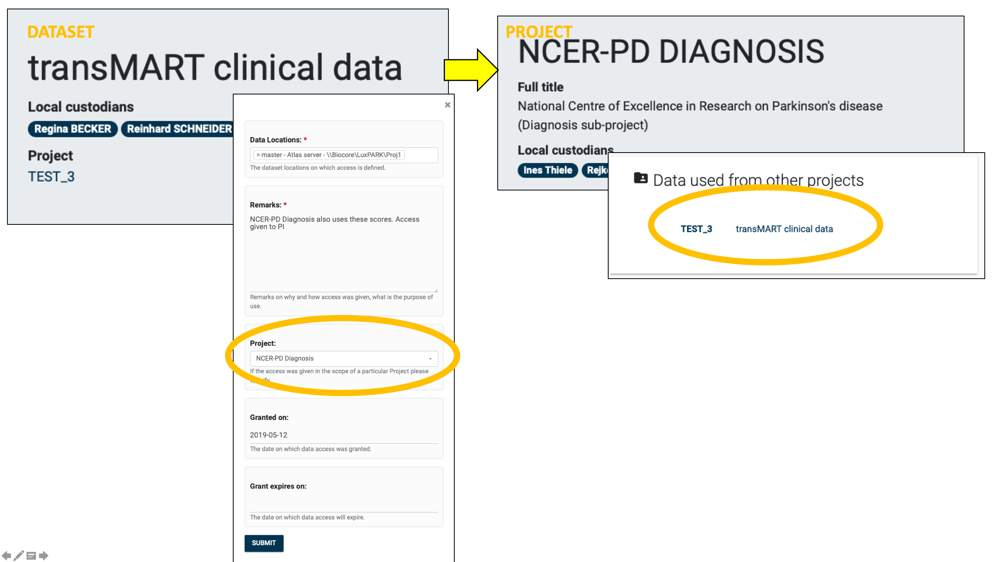

For details on access status lifecycle, audit trail, permissions, and API exposure see [Access Management](access_management.md).

[Back to top](#4-dataset-management)

## 4.2.5 Manage Dataset Transfers

*Transfers* holds information on datasets flow between project's parties and details on datasets access by external partners. Dataset can be transferred to the external partners or they can get access to view the datasets.

<mark> To add new data transfer: </mark>

1. Click the plus button on the Transfers details box.

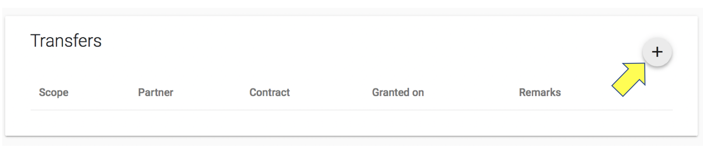

2. The *Transfer create form* will be displayed.  Fill in the fields. Note that  *Partner* is a mandatory field.

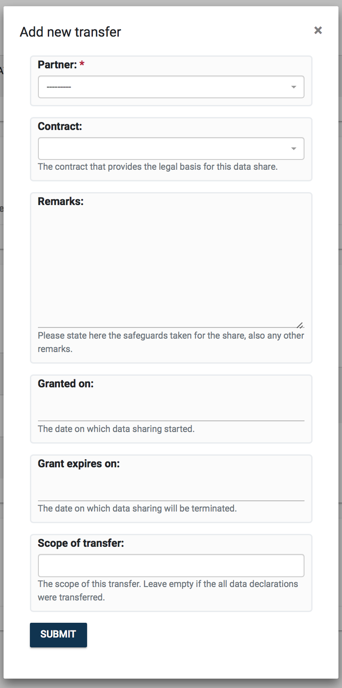

3. Click SUBMIT. In the *Dataset Search Page* you will see the transfer you have just added. Transfers can be edited or deleted by clicking on the pencil/trash icons in the *Transfers detail box*.

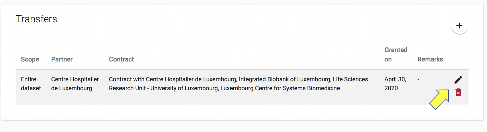

[Back to top](#4-dataset-management)

## 4.2.6 Appendix for VIP user

By clicking *eye button* in the dataset overview box, VIP user can enter *Change permission* page.
The management of the dataset's access permissions is alike to project's permissions described in
[**3.2.7 VIP appendix**](project_management_details.md#327-appendix-for-vip-users).

<!-- This section describes management of the dataset's access permissions. If VIP user (check [users groups here](/manual/#what-are-the-users-groups)) owns a dataset or is its Local Custodian, he can grant other users with permissions for the dataset.

By clicking *eye button* in the dataset overview box, VIP user can enter *Change permission* page.

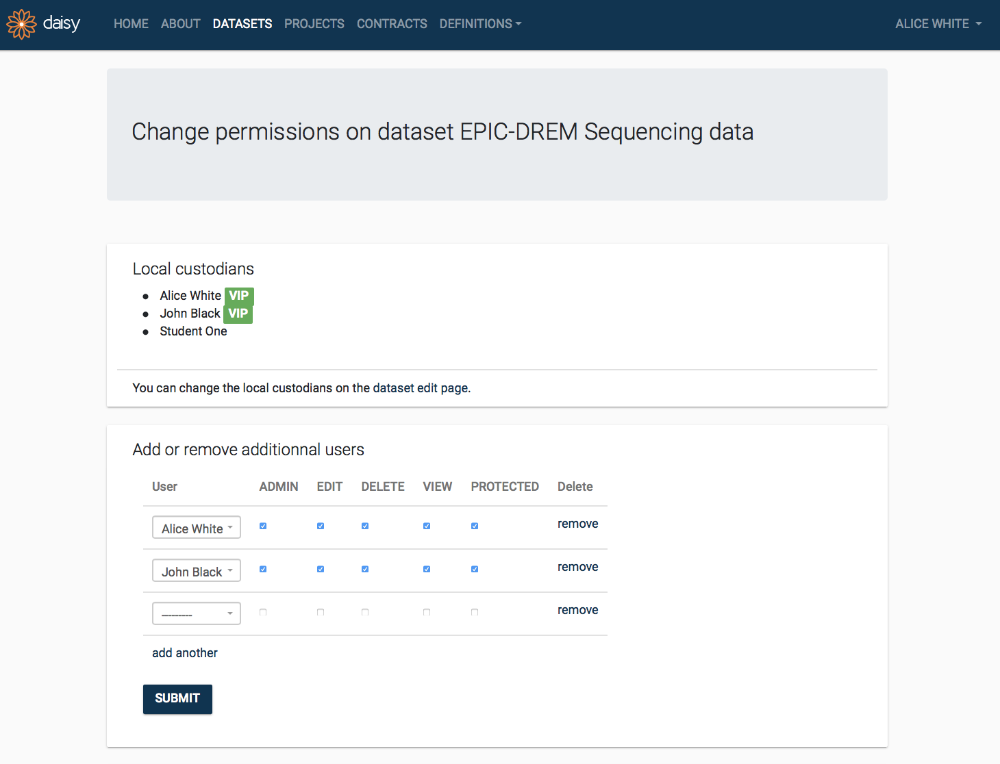

#### Permissions

- **Admin**
  Grant the right to change permissions on this dataset and grant all other permissions.
- **Edit**
  Grant the right to edit this dataset.
- **Delete**
  Grant the right to delete this dataset.
- **View**
  Grant the right to view this dataset.
- **Protected**
  Grant the right to access protected information on this dataset. -->

[Back to top](#4-dataset-management)
