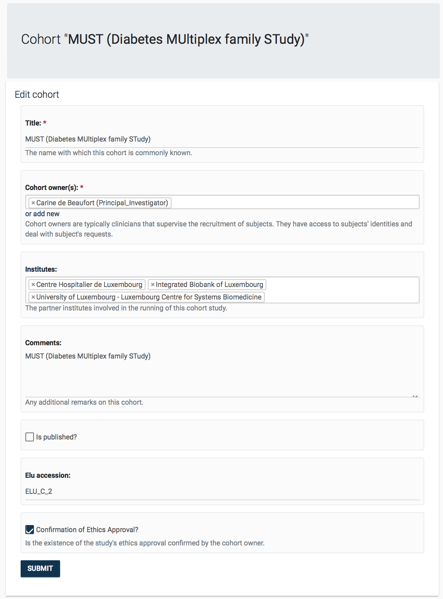
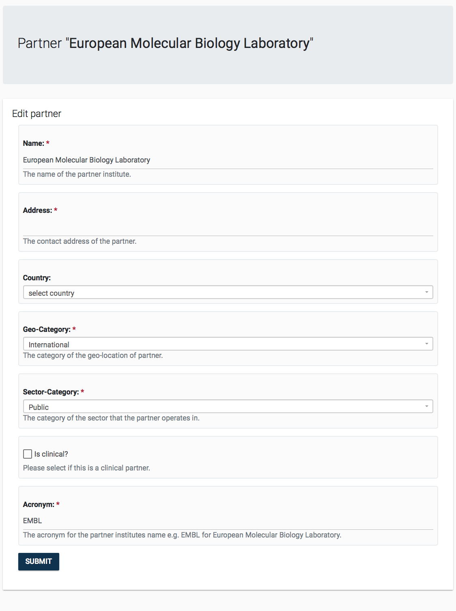
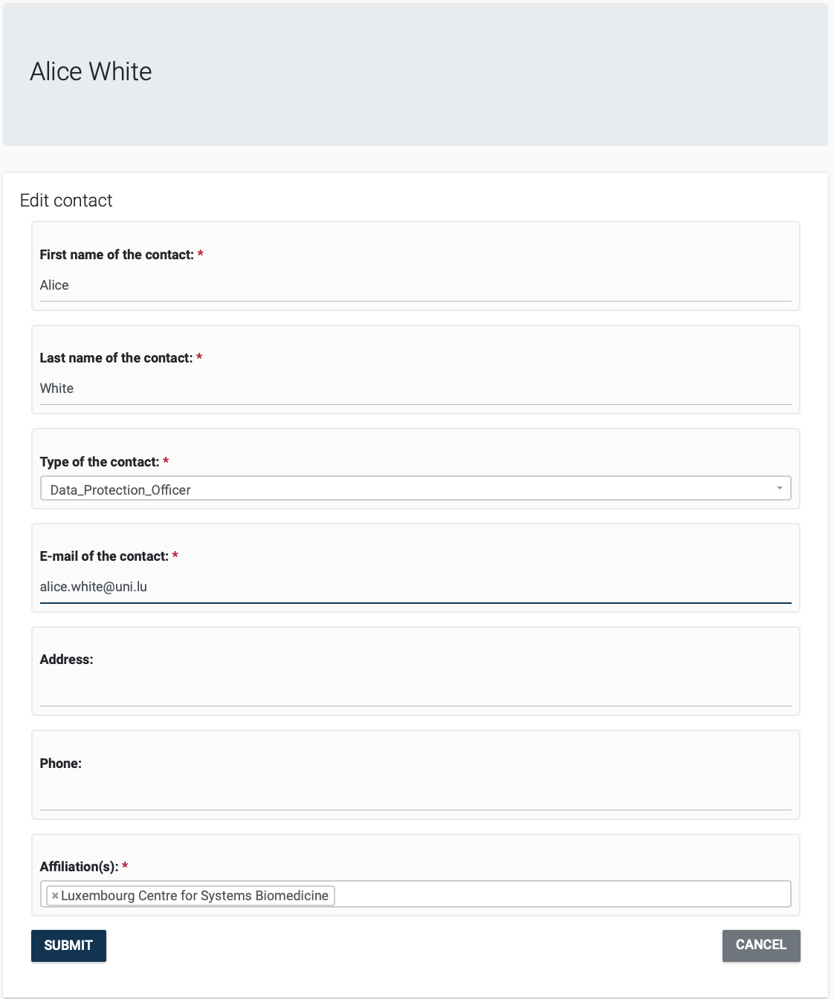

<small>
[User guide](/manual/daisy) &raquo; [*Definitions (**GO BACK to main page**)*](/manual/daisy/#definitions)
</small>

# 6 Definitions Management

DAISY *Definitions* module allows for the management of *Contacts*, *Cohorts* and *Partners*.

## 6.1 Cohorts
Cohort is a study that collects data and/or bio-samples from a group of participants (e.g. longitudinal case-control or family studies). A cohort is linked to the creation of data and is considered its ultimate source.

In order to effectively handle data subjects' requests, as per GDPR, it is crucial that an institution keeps track of what data it keeps from which cohorts. Inline with this, DAISY allows maintaining a list of *Cohorts* and link  *Datasets* to *Cohorts*.

The information kept on cohorts can be seen in the associated *Editor Page* seen below. Cohorts are expected to have a *Title* unique to them, and they are  linked to one or more *Cohort Owners*, which are that are Principle Investigators, Clinicians running the study. Cohorts owners are kept as *Contacts* in DAISY. In order to maintain a controlled list of cohorts, the administrator for the DAISY deployment may assign an accession number to the *Cohort*, which would be the unique identifier for this Cohort.

## 6.2 Partners

A *Partner* is a research collaborator that is the source and/or recipient of human data. Partners are also legal entities with whom contracts are signed. Clinical entities that run longitudinal cohorts, research institutes, or data hubs are all examples of Partners.
In accordance, when maintaining *Data Declaration's* data source, *Dataset* transfer or when creating *Contract* records, you will be asked to select Partners.

The information kept on partners can be seen in the associated *Editor Page* seen below.

## 6.3 Contacts

*Contacts* are people affiliated with the external partner institutions (e.g. collaborator principle investigators, project officers at the EU).
DAISY keeps the contact details (e.g email address, affiliations) of external collaborators related to the *Projects*, *Datasets*, *Cohorts* and *Contracts*.

Standard information is kept on contacts as can be seen in the associated *Editor Page* given below.

