<small>
[User guide](daisy.md) &raquo;  [*Projects (**GO BACK to main page**)*](daisy.md#21-projects)
</small>

# 3 Project Management
This section describes how to add a new project. Adding a project is available for standard user and VIP user.

## 3.1 Create New Project

In order to create a new project:

1. Click Projects from the Menu Bar to enter Project Search Page.

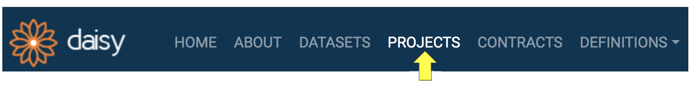

2. Click the add button in the right bottom corner.

3. You will see an empty Project Form. *Acronym*, *Title* and *Local Custodians* are mandatory fields, whereas the others are optional. Provide the values for the fields. Note that at least one of the Local Custodians **must be VIP user**.

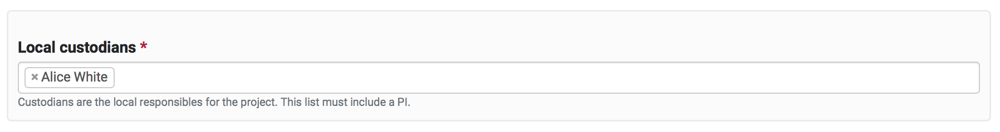

4. Click SUBMIT. Once you successfully save the form, you will be taken to the newly create project's details page, as see below.

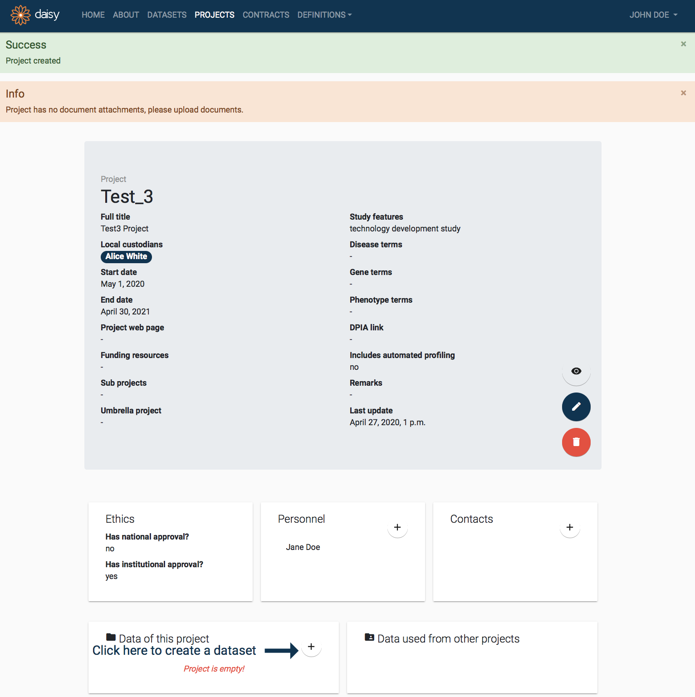

## 3.2 Manage Project Details

When you first create a *Project* in DAISY, it will be isolated, with no links to other entities. The project page provides shortcuts to create (and edit) following entities: dataset, contract, personnel, contacts, documentation and publications. If you use these shortcuts the newly created entities will automatically be linked to the project.
To add some details, click plus button in the particular entity box.

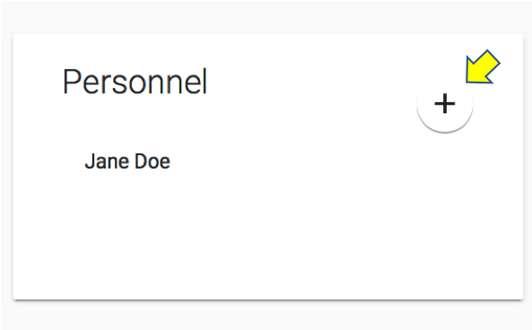

## 3.2 Manage Project Details

This section describes how to manage the project's entities details. Newly created project in DAISY has no links to other entities (e.g. personnel). Simply by clicking the plus button in the entity details box, you can create entity, which will automatically be linked to the project.

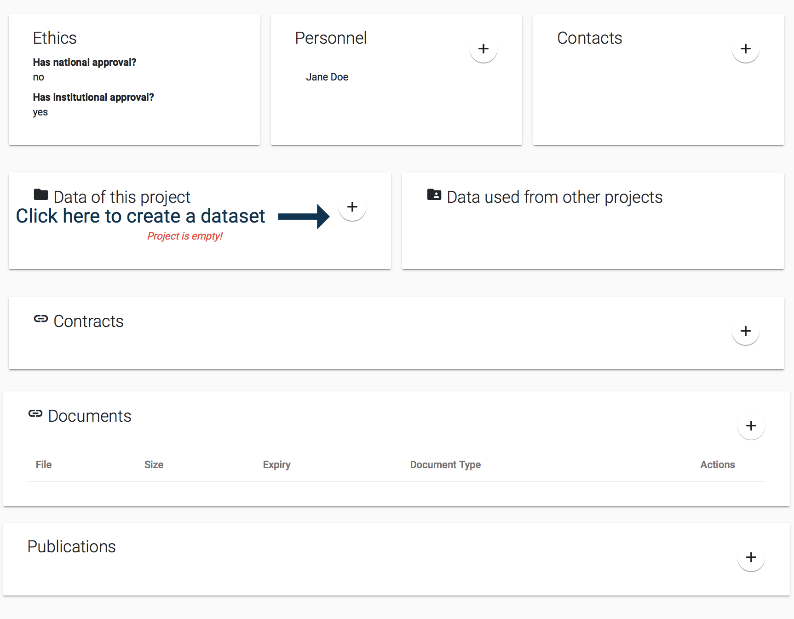<small>Project's entities detail</small>

### 3.2.1 Add Project Dataset

When a project is created, it will have no associated datasets. On the project's details page this situation will be highlighted in the *Data of this project* detail box as follows:

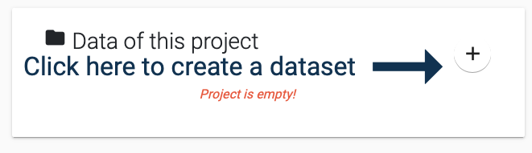

<mark>In order to create a Dataset and automatically link it to the project:</mark>

1. Click the **Add** button pointed by the arrow in the *Data of this project* detail box.

2. You will see the **Dataset Creation Quick Form** as below. The *Project* field will be auto-selected, in addition you need to provide *Local Custodians* and a *Title* for your dataset. Typically the local custodians would be the same as the project, but you are free to choose any user as the custodian. Remember that one of the custodians needs to be a VIP user. Provide the field values and press submit.

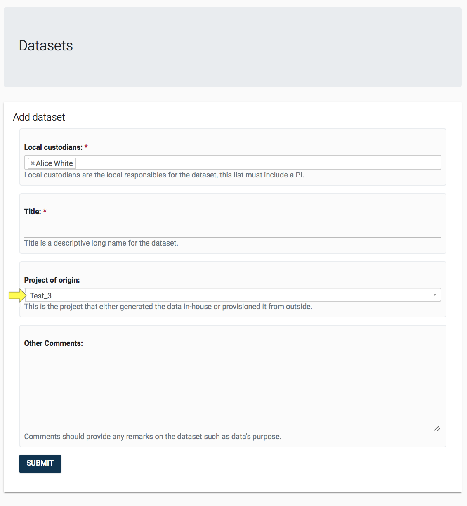

3. Once the dataset is created, you will be taken to the **Dataset's Details Page**, seen below. You can continue working on the data set as described in [section Dataset Management](dataset_management_details.md).

If you want to go back to the Project that owns this dataset, then you can click the project link in the dataset's overview box, highlighted below.

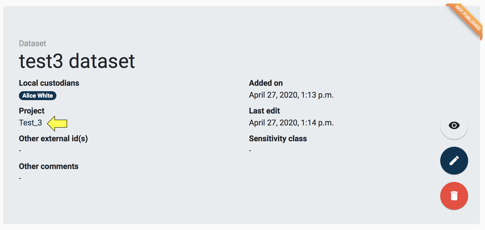

### 3.2.2 Add Project Contract

Contract allows for recording legal documents signed in the context of research activities. It provides the necessary traceability for the GDPR compliant provision and transfer of data.

<mark>To add new contract to the project:</mark>

1. Click the plus button on the Contract details box.

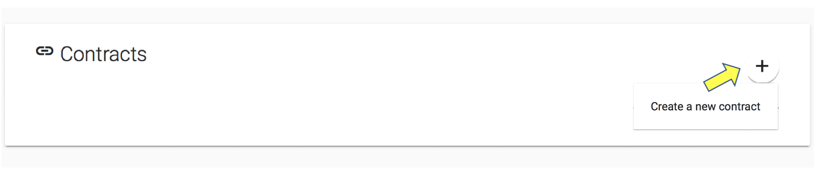

2. You will see the *Contract Creation Quick Form* as below. In the *Roles* field, you are expected to select one or more GDPR role that identifies your institutions roles as described in the Contract ([find out more about the GDPR roles.](https:/edps.europa.eu/sites/edp/files/publication/19-11-07_edps_guidelines_on_controller_processor_and_jc_reg_2018_1725_en.pdf))
Remember that one of the custodians needs to be a VIP user. Provide the field values and press submit.

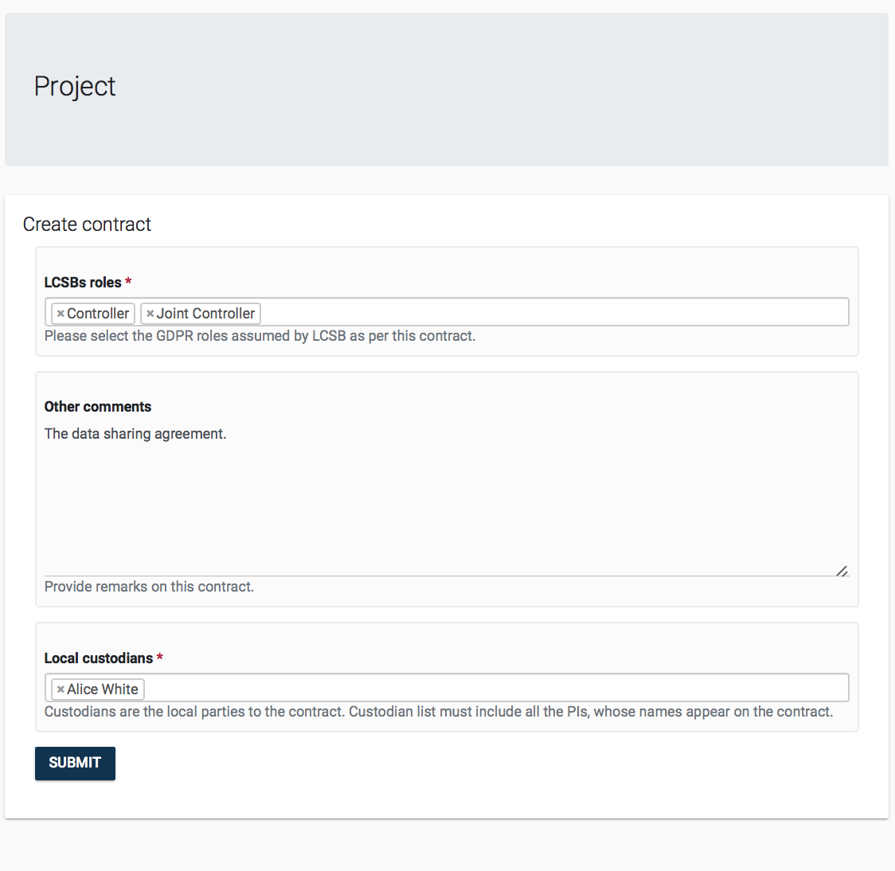

1. The contract can be viewed by clicking its name in the detail box. (See section [Contract Management](contract_management_details.md).) The contract can be removed from a project by clicking on the trash icon that will appear when hovering over the items in the *Contracts* detail box.

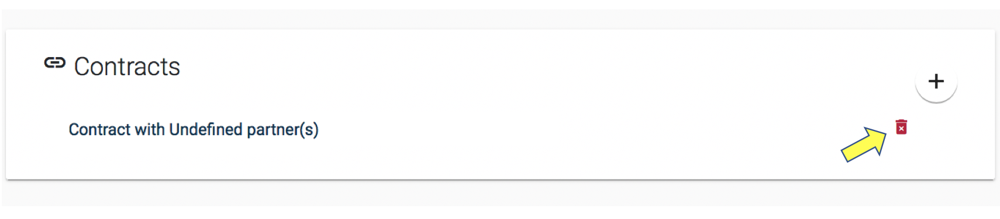

### 3.2.3 Add Project Personnel

A project's *Personnel* refer to those persons that work on the project, we assume that these persons will all have a user account for the DAISY system. The *Personnel* detail box on the *Project* page also allows linking DAISY *Users* as personnel of a project.

<mark>To add personnel to the project:</mark>

1. Click the plus button on the *Personnel* details box.

2. You will be asked to select one user from a searchable list of existing users. Users will be listed with their name and surname. Make a selection and click SUBMIT.

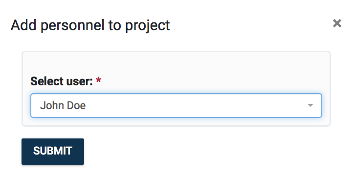

Personnel can be unlinked from a Project by clicking on the trash icon that will appear when hovering over items in the *Personnel detail box*, as seen below. Note that the personnel will not be deleted from the system, it will simply be unlinked.

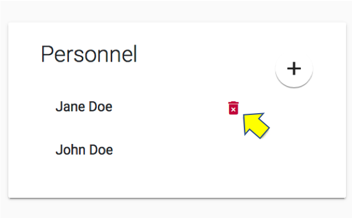

### 3.2.4 Manage Project Contacts

A project's *Contacts* refer to those persons that are associated with the project, but these **are not users** of the DAISY system. Under the [*Definitions Management*](definitions_management_details.md) module, it is possible to manage *Contacts* and search for them. Management of contacts can be also done directly on *Project's* page via The *Contacts* detail box.

<mark>To add project's contact details:</mark>

 1. Click the plus button on the Contacts details box. You will be given the options to either **Link to existing contact** or **Create a new contact**, as seen below.

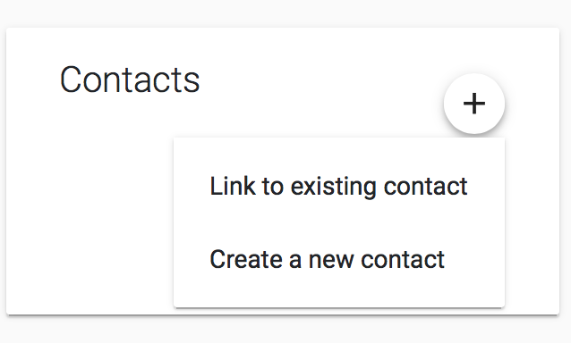

 2. If you choose to link, you will be asked to select one contact from the drop down list of existing contacts. Contacts will be listed with their name, surname and role as seen below. Make a selection and click SUBMIT.

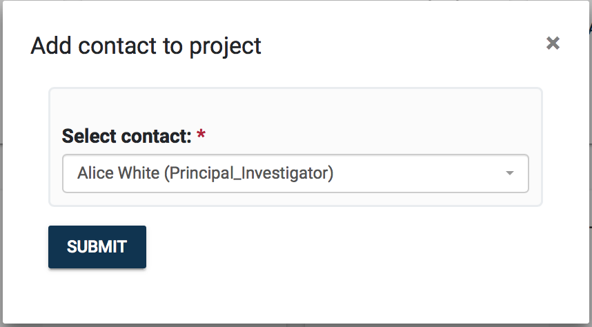

 3. If you choose to create new one, you will see the contact creation form. Once you fill in the details and click SUBMIT a new contact will be created and automatically linked to the project.

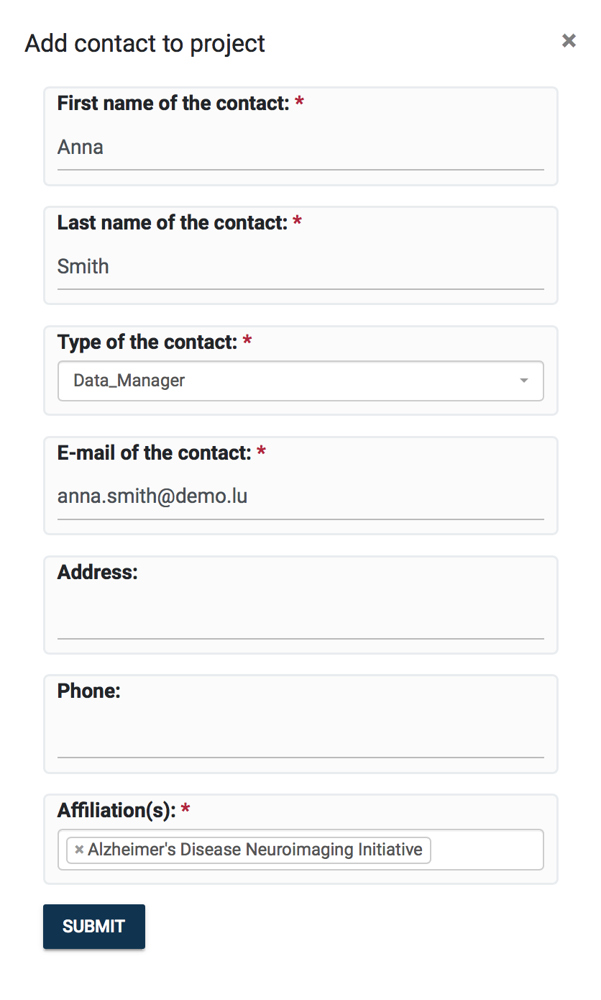

Contacts can be unlinked from a Project by clicking on the trash icon that will **appear when hovering over** items in the Contacts detail box, as seen below. Note that the contact will not be deleted from the system, it will simply be unlinked.

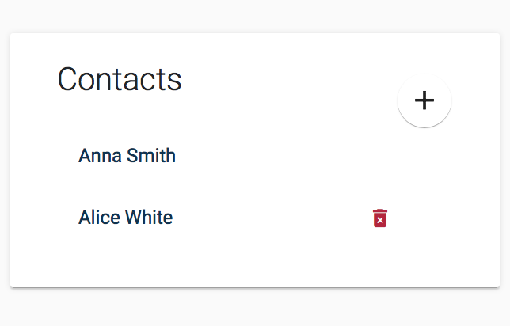

### 3.2.5 Manage Project Documentation

Document management is done via the *Documents* detail box. You can attach documents to a project record in DAISY. Some examples of the documents are listed below:

  - Project Proposal
  - Ethics Approvals
  - Templates of Consent Form
  - Subject Information Sheet

<!-- Documents can be in any format, PDF, Word or scans. If the document is stored already in an external system, you can also record its link in DAISY. -->

The format of the documents is not limited, these can be PDF, Word or images. If the document is stored already in an external system, you can also record its link in DAISY.

<mark>To add new document:</mark>

  1. Click the plus button on the *Documents* detail box.

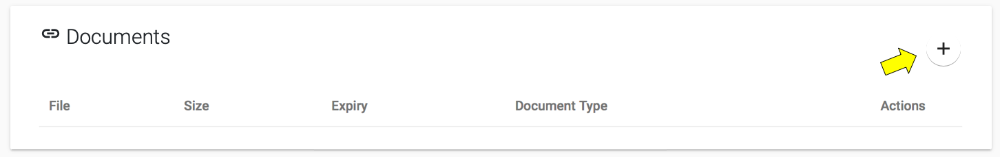

  2. You will see the *Document creation form*. Either select *Content* to upload a file or paste the document link (if exists in an external system). You will be required to provide a brief description of the document in *Document Notes*. You will be also required to select a *Domain Type* for the document.

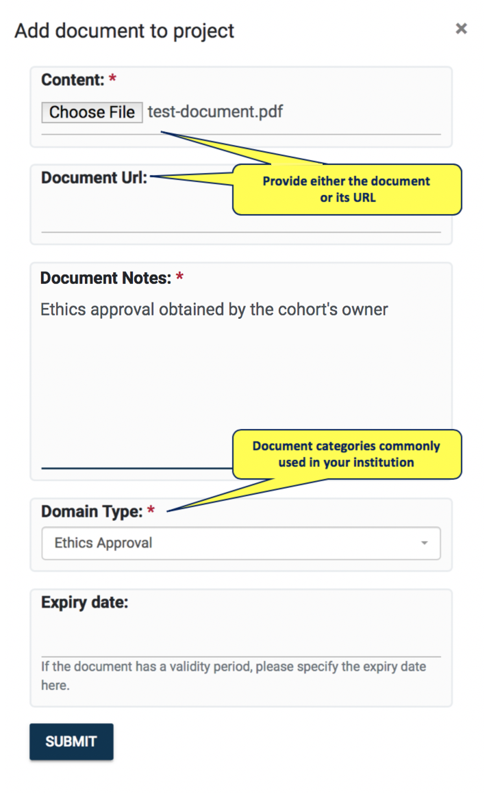

  3. Click SUBMIT and the new document will be listed as below. Documents can be deleted by clicking on the trash icon beside each document. The document information can be edited by clicking the pencil icon.

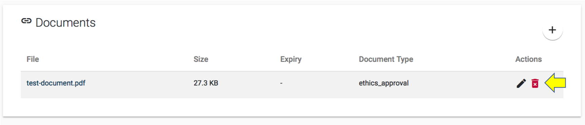

### 3.2.6 Manage Project Publications

A project's *Publications* can be managed via the *Publications detail box*.

<mark>To add new publication:</mark>

 1. Click the plus button  on the *Publications* detail box. You will be given the options to either **Link to existing publication** and **Create a new publication**.

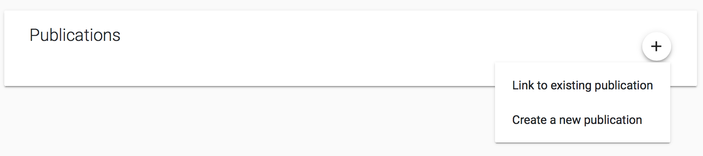

 2. If you choose to link, you will be asked to select one publication from a searchable list of existing publications. Publications will be listed with their citation string. Make a selection and click SUBMIT.

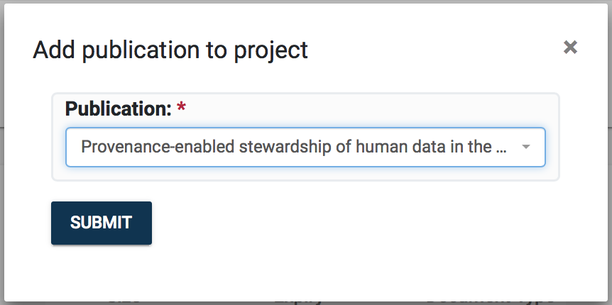

 3. If you choose to create new, you will see *Publication creation form* asking you for the *Citation string* and the paper's *DOI*. Once you fill in the details, click SUBMIT. The new publication will be created and automatically linked to the project.

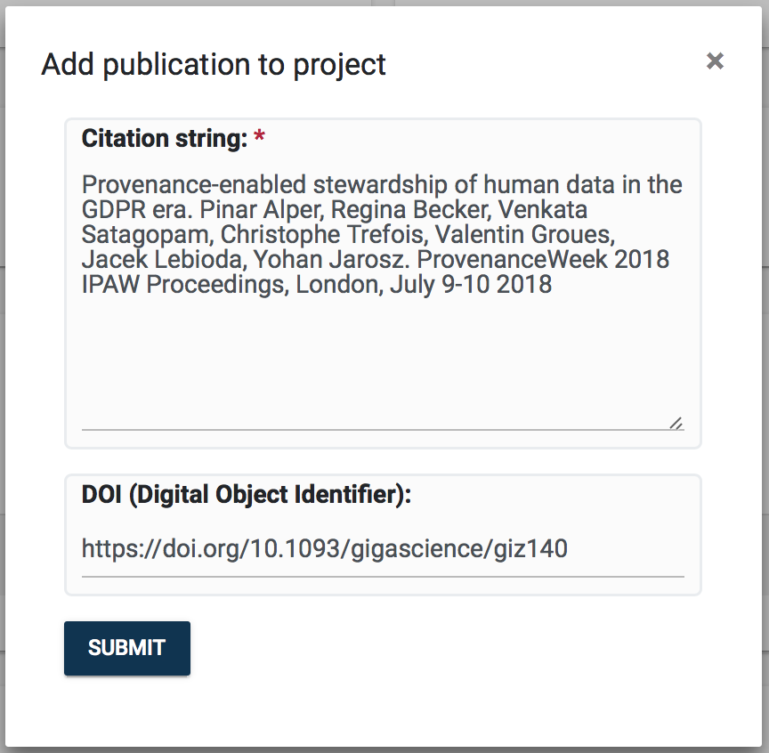

Publications can be unlinked from a project by clicking on the trash icon that will **appear if hovering over** items in the *Publications detail box*, as seen below. Note that the publication will not be deleted from the system, but simply unlinked from project.

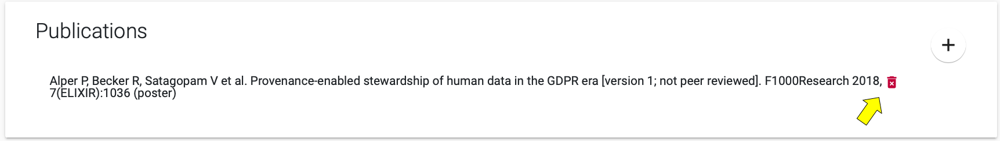

### 3.2.7 Appendix for VIP users

This section describes management of the project's access permissions. If VIP user owns a project or is its Local Custodian, he can grant users with the project's privileges.

By clicking *eye button* in the project overview box, VIP user can enter *Change permission* page.

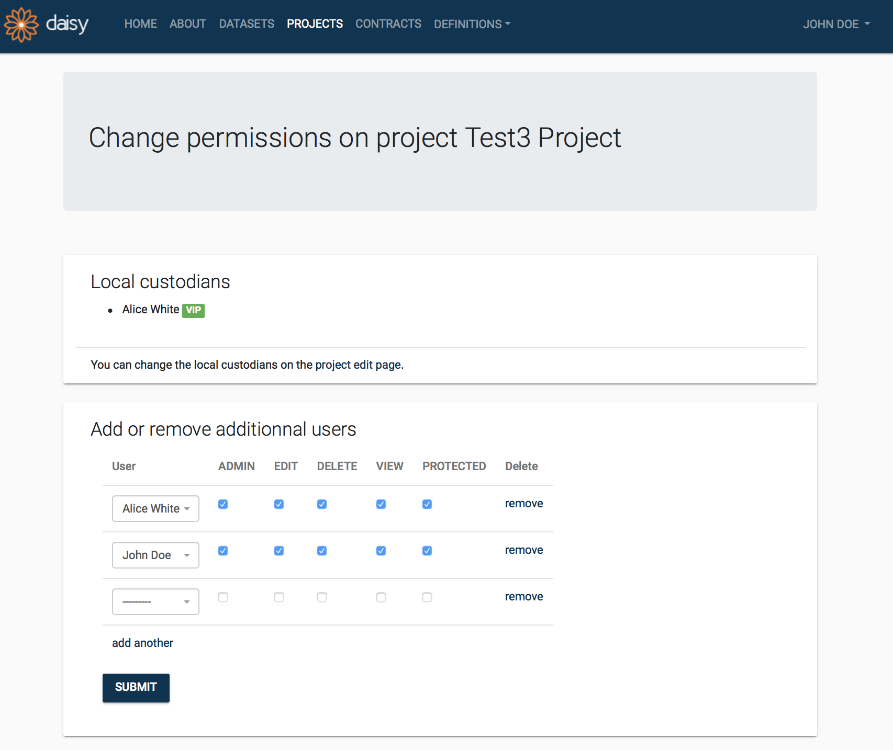

#### Permissions

- **Admin**
  Grant the right to change permissions on this project and grant all other permissions.
- **Edit**
  Grant the right to edit this project.
- **Delete**
  Grant the right to delete this project.
- **View**
  Grant the right to view this project.
- **Protected**
  Grant the right to access protected information on this project.

[Back to top](#3-project-management)
