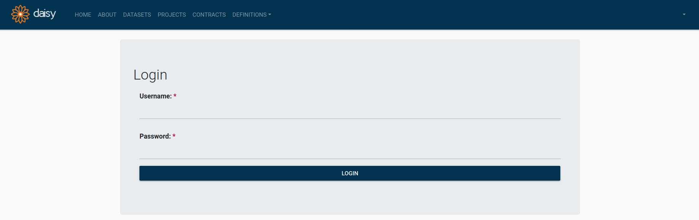
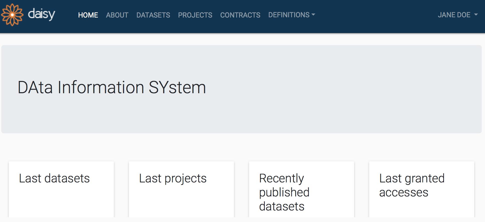

# Login to DAISY

Upon successful installation of DAISY, go to the web address
`https://${IP_ADDRESS_OR_NAME_OF_DEPLOYMENT_SERVER}`, where you should display the login page.

<!-- If you are University of Luxembourg staff you can go to [https://daisy.lcsb.uni.lu/](https://daisy.lcsb.uni.lu/).
You can also check [DAISY demo deployment](https://daisy-demo.elixir-luxembourg.org/). -->

Based on the authentication configuration made for your deployment, you may log in by:

* the user definitions in an existing LDAP directory, e.g. institutional/uni credentials.
* the user definitions maintained within the DAISY database.

<small>DAISY Login Page</small>

After successful login, you see DAISY home page.

<small>DAISY Home Page</small>

[Back to top](#login-to-daisy)
