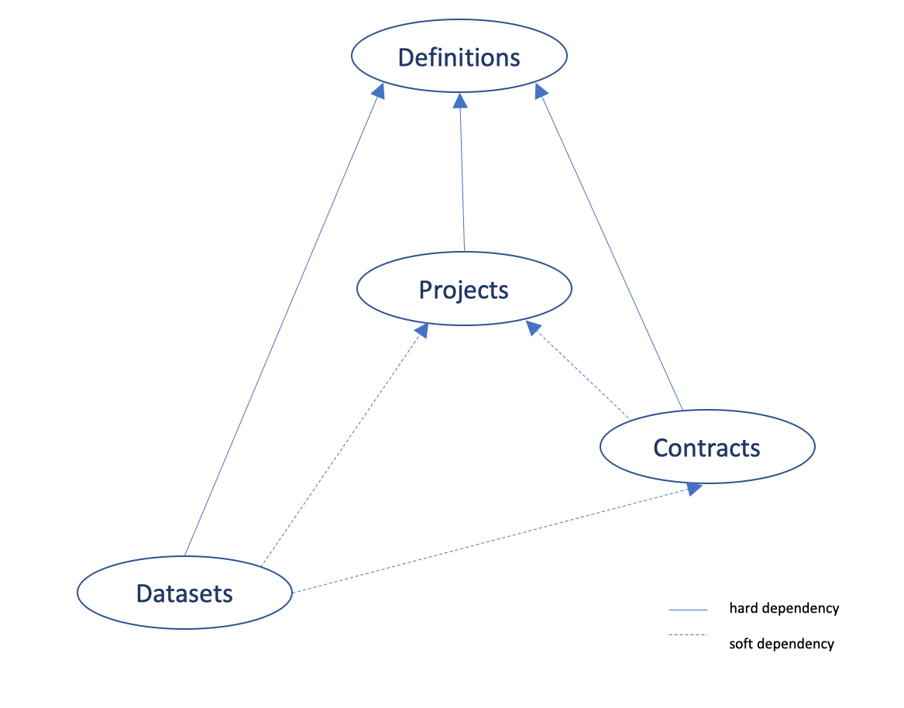

<small>
[User guide](daisy.md) &raquo; [*3 Different types of DAISY users (**GO BACK to main page**)*](daisy.md#3-different-types-of-daisy-users)
</small>

# Users Groups and Permissions

DAISY is intended to be used mostly by three categories of end users in a biomedical research institutions:

  - Research staff (e.g. principle investigators, lab members)
  - Legal support team
  - IT and data management specialists

Above categories are assigned to particular DAISY **user groups**, which support the control of records access:

  -  **Standard**
      This is the default group that users are mainly assigned to. All DAISY users can view all *Dataset*, *Project*, *Contract* and *Definitions* (*Cohorts*, *Partners*, *Contacts*). The document attachments of the records are excluded from this view permission.

  -  **VIP**
      The research principle investigators are typically assigned to this group. VIP users have all privileges on the records they own, meaning the records where the user has been appointed as the `Local Custodian`. They also have the right to give permissions to others on these records.

  -  **Legal**
      This group allows users to manage *Contract* records. Legal personnel will be able to create view and edit contract as well as view all other records in DAISY and manage their document attachments

  - **Auditor**
      This role would designed to an external person, who is given view-only temporary access to all DAISY records. This is typically happening during an audit scenario.

Inside the group a user can be assigned with a specific **role**, which specifies his project's permissions:

  - Project's owner
  - Local Custodian
  - Regular user

The *back end user* is called *superuser* and is granted with *all* DAISY privileges - to manage the application's content and administer DAISY settings.

DAISY supports fine-grained permission management with the following categories of permissible actions.
The users permissions are summed up in the below table:

<!-- {:width="900px"}<small>Users permissions</small>

| User Category | Administer Permissions | Delete | Edit | View | View  Document Attachments |
| -------------|:-------------:|:-------------:|:-------------:|:-------------:|:-----|
| superuser | Pall, Dall, Call, Defall | Pall, Dall, Call, Defall| Pall, Dall, Call, Defall| Pall, Dall, Call, Defall | Pall, Dall, Call, Defall|
| standard |  | | | Pall, Dall, Call, Defall | |
| vip | Pown, Down | Pown, Down| Pown, Down| Pall, Dall, Call, Defall  | Pown, Down, Cown |
| auditor |  | | |Pall, Dall, Call, Defall| Pall, Dall, Call, Defall |
| legal | Call | Call | Pall, Dall, Call, Defall | Pall, Dall, Call, Defall | Pall, Dall, Call, Defall |

 [Back to top](#top)

WHERE PUT THAT ?
The dependencies between DAISY modules are given below. There are no hard dependencies between Projects, Contracts and Datasets modules. In principle you may start using any of these modules once DAISY is deployed with the pre-packed definitions.

<small>DAISY module dependencies</small>
 -->
